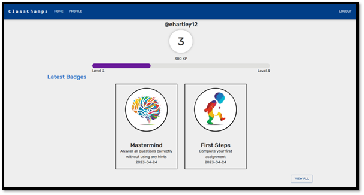
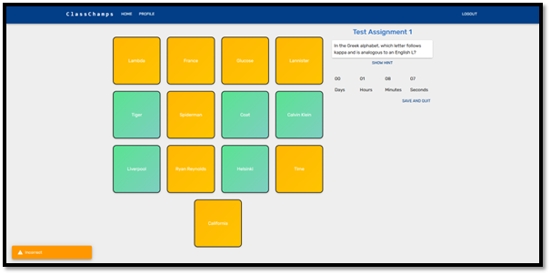
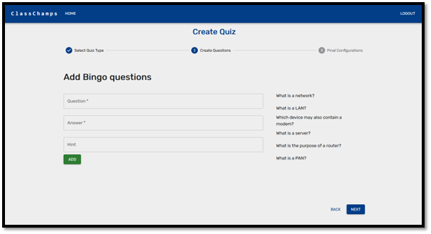

# ClassChamps
### A gamified online homework application

My dissertation project which focuses on investigating the methods used to improve intrinsic student motivation and to explore the potential of gamification elements to enhacnce these methods. Gamification elements include: Achievement badges, class leaderboards, and an experience level system. 

## Architecture
**React.js** front-end  
**Node.js** and **Express** back-end  
**MongoDB** database

## Screenshots
**Profile Page**  

**Classroom Page**  

**Bingo minigame**  

**Create a new quiz**  

