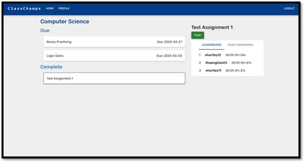

# ClassChamps
### A gamified online homework application

My dissertation project that focuses on investigating the methods used to improve intrinsic student motivation, and to explore the potential of gamification elements to enhance these methods. Gamification elements include: Achievement badges, class leaderboards, and an experience level system. 

## Architecture
**React.js** front-end  
**Node.js** and **Express** back-end  
**MongoDB** database

## Testing
I created a separate MongoDB database for running unit and integration tests in the back-end. The Jest testing framework was used, as well as the `supertest` npm package to wrap the express application in so HTTP requests could be made during testing.

## Screenshots
**Classroom Page**  

**Bingo minigame**  

**Profile Page**  

**Create a new quiz**  

